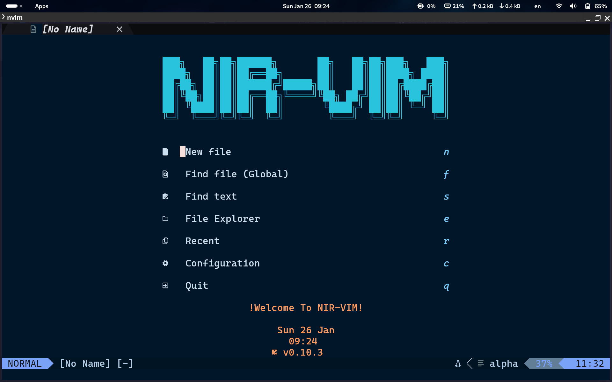
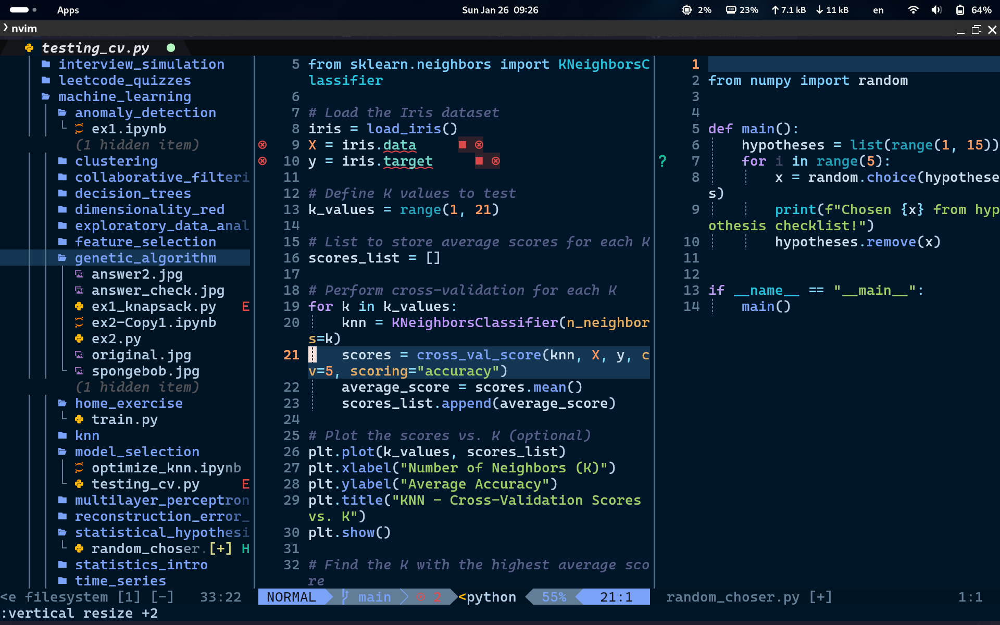
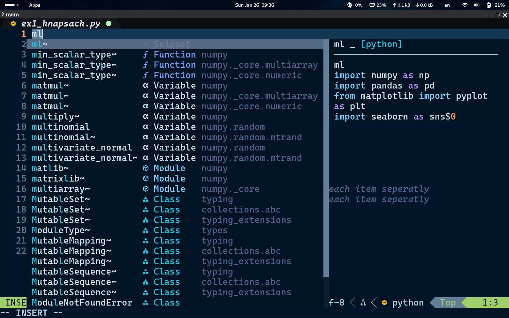

# Nir-Vim

Nir-Vim is a blazing-fast Neovim configuration tailored for AI and Machine Learning development. Built on top of the powerful [LazyVim](https://github.com/LazyVim/LazyVim), it provides intuitive key mappings, extensive plugin support, and a seamless IDE experience for Python, C, C++, and more. Nir-Vim also features a custom compiler, making it an all-in-one tool for developers.

---

## Features

- **Specialized for AI/ML Development**: Includes Python snippets for machine learning workflows.
- **Custom Compiler**: Quickly compile and run Python, C, and C++ code with a single keystroke (F6).
- **Plugin Power**: Integrates with popular plugins to enhance productivity and usability.
- **Flexible LSP Support**: Install and manage language servers via [Mason.nvim](https://github.com/williamboman/mason.nvim).
- **Intuitive Design**: Easy-to-remember key mappings and a clean, aesthetic design.
- **Multi-Theme Support**: Includes several beautiful themes like Dracula, Ayu, and Catppuccin.

---

## Installation

### Prerequisites

Before installing Nir-Vim, ensure the following are installed on your system:

- Neovim >= 0.9.5
- Git
- Node.js
- npm
- Python 3 with `python3-venv`
- [LazyGit](https://github.com/jesseduffield/lazygit)
- [Nerd Fonts](https://www.nerdfonts.com/)
- [live-server](https://www.npmjs.com/package/live-server)

### Automated Installation

To simplify the setup process, Nir-Vim includes an installation script. Run the following commands to install all prerequisites and Nir-Vim:

```bash
git clone https://github.com/Nirerp/Nir-Vim.git
cd nir-vim
chmod +x install_nirvim.sh
./install_nirvim.sh
```

The script will handle everything from installing dependencies to setting up Nir-Vim on your system.

---

## Key Plugins

### Core Plugins
- [LazyVim](https://github.com/LazyVim/LazyVim): Base configuration.
- [nvim-treesitter](https://github.com/nvim-treesitter/nvim-treesitter): Syntax highlighting and parsing.
- [nvim-lspconfig](https://github.com/neovim/nvim-lspconfig): Built-in LSP support.
- [Mason.nvim](https://github.com/williamboman/mason.nvim): LSP, DAP, and tool manager.
- [nvim-cmp](https://github.com/hrsh7th/nvim-cmp): Autocompletion engine.

### AI/ML Enhancements
- [RRethy/vim-illuminate](https://github.com/RRethy/vim-illuminate): Highlights usage of words under the cursor.
- [folke/trouble.nvim](https://github.com/folke/trouble.nvim): Diagnostics and quickfix list.
- [folke/todo-comments.nvim](https://github.com/folke/todo-comments.nvim): Highlight and manage TODO comments.

### Productivity Boosters
- [nvim-telescope](https://github.com/nvim-telescope/telescope.nvim): Fuzzy finder and search engine.
- [lukas-reineke/indent-blankline.nvim](https://github.com/lukas-reineke/indent-blankline.nvim): Indentation guides.
- [numToStr/Comment.nvim](https://github.com/numToStr/Comment.nvim): Easy code commenting.
- [stevearc/dressing.nvim](https://github.com/stevearc/dressing.nvim): UI enhancements.

### Visual Enhancements
- [nvim-lualine](https://github.com/nvim-lualine/lualine.nvim): Statusline.
- [nvim-web-devicons](https://github.com/nvim-tree/nvim-web-devicons): File type icons.
- Themes:
    - [Mofiqul/vscode.nvim](https://github.com/Mofiqul/vscode.nvim)
    - [Shatur/neovim-ayu](https://github.com/Shatur/neovim-ayu)
    - [catppuccin.nvim](https://github.com/catppuccin/nvim)
    - [Mofiqul/dracula.nvim](https://github.com/Mofiqul/dracula.nvim)
    - [navarasu/onedark.nvim](https://github.com/navarasu/onedark.nvim)
    - [EdenEast/nightfox.nvim](https://github.com/EdenEast/nightfox.nvim)

---

## Key Bindings

- `Leader = Space`: Opens [WhichKey](https://github.com/folke/which-key.nvim) to display all key mappings.
- `Compiler = <F6>`: Opens up a Toggle-Term and runs the current script you're coding.

---

## Custom Python Snippets

Nir-Vim comes with preconfigured Python snippets tailored for AI/ML workflows. Example:

```python
ls.add_snippets("python", {
    s("knn", {
        t({
            "from sklearn.model_selection import GridSearchCV",
            "from sklearn.pipeline import Pipeline",
            "from sklearn.preprocessing import StandardScaler",
            "from sklearn.neighbors import KNeighborsClassifier",
            "from sklearn.model_selection import train_test_split",
            "from sklearn.metrics import confusion_matrix, classification_report, accuracy_score",
        }),
    })
})
```

---

## Screenshots and Demo




### Snippet Examples:



### Demo Video

[](path/to/demo.mp4)

---

## Credits

Special thanks to the creators of the amazing plugins used in Nir-Vim:

- [LazyVim](https://github.com/LazyVim/LazyVim)
- [alpha-nvim](https://github.com/goolord/alpha-nvim)
- [nvim-autopairs](https://github.com/windwp/nvim-autopairs)
- [bufferline.nvim](https://github.com/akinsho/bufferline.nvim)
- [vscode.nvim](https://github.com/Mofiqul/vscode.nvim)
- [neovim-ayu](https://github.com/Shatur/neovim-ayu)
- [catppuccin.nvim](https://github.com/catppuccin/nvim)
- [dracula.nvim](https://github.com/Mofiqul/dracula.nvim)
- [onedark.nvim](https://github.com/navarasu/onedark.nvim)
- [nightfox.nvim](https://github.com/EdenEast/nightfox.nvim)
- [Comment.nvim](https://github.com/numToStr/Comment.nvim)
- [rainbow_csv.nvim](https://github.com/cameron-wags/rainbow_csv.nvim)
- [dressing.nvim](https://github.com/stevearc/dressing.nvim)
- [conform.nvim](https://github.com/stevearc/conform.nvim)
- [vim-illuminate](https://github.com/RRethy/vim-illuminate)
- [indent-blankline.nvim](https://github.com/lukas-reineke/indent-blankline.nvim)
- [lazygit.nvim](https://github.com/kdheepak/lazygit.nvim)
- [nvim-lint](https://github.com/mfussenegger/nvim-lint)
- [live-server.nvim](https://github.com/barrett-ruth/live-server.nvim)
- [lualine.nvim](https://github.com/nvim-lualine/lualine.nvim)
- [nvim-cmp](https://github.com/hrsh7th/nvim-cmp)
- [nvim-web-devicons](https://github.com/nvim-tree/nvim-web-devicons)
- [refactoring.nvim](https://github.com/ThePrimeagen/refactoring.nvim)
- [telescope.nvim](https://github.com/nvim-telescope/telescope.nvim)
- [todo-comments.nvim](https://github.com/folke/todo-comments.nvim)
- [toggleterm.nvim](https://github.com/akinsho/toggleterm.nvim)
- [nvim-treesitter](https://github.com/nvim-treesitter/nvim-treesitter)
- [trouble.nvim](https://github.com/folke/trouble.nvim)
- [vim-isort](https://github.com/fisadev/vim-isort)
- [which-key.nvim](https://github.com/folke/which-key.nvim)

---

## License

[MIT License](LICENSE)

